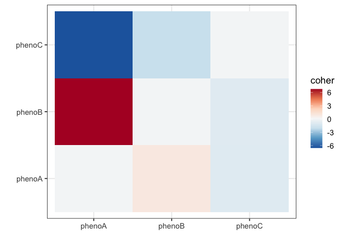

<!-- README.md is generated from README.Rmd. Please edit that file -->

# coher

An R package for the estimation of co-heritability of phenotypic traits
in bacteria.

## Installation

The development version is available on github. It can be installed with
`devtools`

``` r
install.packages("remotes")

remotes::install_github("tienmt/coher")
```

If you would like to also build the vignette with your installation run:

``` r
remotes::install_github("tienmt/coher", build_vignettes = TRUE)
```

## Quick Start

Run coher

``` r
# install.packages('coher')
library(coher)

data("coher_example")
result <- coher(coher_example$Y, coher_example$X)
#> [1] "continuous"
#> [1] "continuous"
#> [1] "continuous"
#> [1] "continuous"
```

# Introduction

This example includes the loading of variant and phenotypic data from a
vcf and csv file.

First we need to load the required libraries and data.

``` r
library(coher)
library(vcfR)
library(ggplot2)

vcf.file.name <- system.file("extdata", "smalldat_coher.vcf.gz", package = "coher")
vcf <- vcfR::read.vcfR(vcf.file.name)
#> Scanning file to determine attributes.
#> File attributes:
#>   meta lines: 6
#>   header_line: 7
#>   variant count: 41286
#>   column count: 612
#> Meta line 6 read in.
#> All meta lines processed.
#> gt matrix initialized.
#> Character matrix gt created.
#>   Character matrix gt rows: 41286
#>   Character matrix gt cols: 612
#>   skip: 0
#>   nrows: 41286
#>   row_num: 0
#> Processed variant 1000Processed variant 2000Processed variant 3000Processed variant 4000Processed variant 5000Processed variant 6000Processed variant 7000Processed variant 8000Processed variant 9000Processed variant 10000Processed variant 11000Processed variant 12000Processed variant 13000Processed variant 14000Processed variant 15000Processed variant 16000Processed variant 17000Processed variant 18000Processed variant 19000Processed variant 20000Processed variant 21000Processed variant 22000Processed variant 23000Processed variant 24000Processed variant 25000Processed variant 26000Processed variant 27000Processed variant 28000Processed variant 29000Processed variant 30000Processed variant 31000Processed variant 32000Processed variant 33000Processed variant 34000Processed variant 35000Processed variant 36000Processed variant 37000Processed variant 38000Processed variant 39000Processed variant 40000Processed variant 41000Processed variant: 41286
#> All variants processed

photype.file.name <- system.file("extdata", "phenotypes.csv.gz", package = "coher")
phenotypes <- read.csv(photype.file.name)
```

Convert data to format required by coher

``` r
X <- vcfR::extract.gt(vcf)
# convert to binary
X <- t(1 * (X == "1/1"))

Y <- lapply(2:ncol(phenotypes), function(j) setNames(phenotypes[, j], phenotypes$isolate))
```

Run coher

``` r
result <- coher(Y, X)
#> [1] "binomial"
#> [1] "binomial"
#> [1] "binomial"
result$coher.matrix
#>            [,1]       [,2]      [,3]
#> [1,]  0.0000000  6.7858406 -6.534649
#> [2,]  0.9625350  0.0000000 -2.080347
#> [3,] -0.9786689 -0.9434753  0.000000
```

We can now plot the results using ggplot2

``` r
plotdf <- data.frame(phenotype.A = rep(colnames(phenotypes)[2:ncol(phenotypes)], 
    3), phenotype.B = rep(colnames(phenotypes)[2:ncol(phenotypes)], each = 3), coher = c(result$coher.matrix), 
    stringsAsFactors = FALSE)

ggplot(plotdf, aes(x = phenotype.A, y = phenotype.B, fill = coher)) + geom_tile() + 
    theme_bw(base_size = 14) + xlab("") + ylab("") + scale_fill_distiller(palette = 5, 
    type = "div")
```

<!-- -->

------------------------------------------------------------------------
